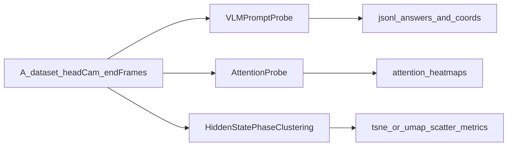

# Gemma 2B 知识探测计划

## 目标与口径

- 验证 Gemma 2B 是否具备任务相关先验知识，不做复杂动作推理，只做表征与可解释性探测。
- 实验入口固定为 `third_party/openpi`（你已确认）。
- C 实验采用你确认的二阶段定义：**以 episode 后 50% 时间内“夹爪闭合时刻”为分界，切分为接触前/接触后**。

## 复用基础（尽量不重造轮子）

- 数据读取与样本流：`[/data/vepfs/users/intern/lingyue.yang/Evo-RL-Piper/third_party/openpi/src/openpi/training/data_loader.py](/data/vepfs/users/intern/lingyue.yang/Evo-RL-Piper/third_party/openpi/src/openpi/training/data_loader.py)`
- A 数据集基础分析脚本（已有特征导出、聚类图、指标框架）：`[/data/vepfs/users/intern/lingyue.yang/Evo-RL-Piper/scripts/analyze_a_dataset_distribution.py](/data/vepfs/users/intern/lingyue.yang/Evo-RL-Piper/scripts/analyze_a_dataset_distribution.py)`
- PaliGemma 前向支持 `output_attentions/output_hidden_states`（可直接提取）：`[/data/vepfs/users/intern/lingyue.yang/Evo-RL-Piper/third_party/openpi/src/openpi/models_pytorch/transformers_replace/models/paligemma/modeling_paligemma.py](/data/vepfs/users/intern/lingyue.yang/Evo-RL-Piper/third_party/openpi/src/openpi/models_pytorch/transformers_replace/models/paligemma/modeling_paligemma.py)`
- A/B 任务子集拆分与 `video` 键处理可参考：`[/data/vepfs/users/intern/lingyue.yang/Evo-RL-Piper/scripts/split_lerobot_v21_by_labels.py](/data/vepfs/users/intern/lingyue.yang/Evo-RL-Piper/scripts/split_lerobot_v21_by_labels.py)`

## 实验流程（A/B/C）

### A. 语义理解探测（VLM Prompting）

- 新增一个轻量脚本（建议：`[/data/vepfs/users/intern/lingyue.yang/Evo-RL-Piper/scripts/probe_gemma2b_vlm_prompting.py](/data/vepfs/users/intern/lingyue.yang/Evo-RL-Piper/scripts/probe_gemma2b_vlm_prompting.py)`）。
- 输入：A 数据集每条 episode 尾段的 `head camera` 图像（默认取末帧，支持 `--tail-k` 从末尾窗口采样）。
- 固定两类问题：
  - Q1：描述物理状态+中间褶皱位置。
  - Q2：给出“拨开中间”建议夹爪图像坐标 `(x, y)`。
- 输出：`jsonl/csv`（episode_id, prompt, raw_text, parsed_xy, image_w, image_h, parse_ok）。
- 判定：
  - 文本语义可用率（是否提到褶皱/中间/可操作区域）。
  - 坐标可解析率 + 坐标落在衣物区域比例（先用简单 bbox/分割近似）。

### B. 注意力图分析（Attention Visualization）

- 在同一脚本或独立脚本（建议：`[/data/vepfs/users/intern/lingyue.yang/Evo-RL-Piper/scripts/probe_gemma2b_attention.py](/data/vepfs/users/intern/lingyue.yang/Evo-RL-Piper/scripts/probe_gemma2b_attention.py)`）增加 `output_attentions=True` 推理分支。
- 仅分析关键词 token：`T恤`、`中间`、`拨开`（中英同义词表可配置）。
- 将关键词 token 对视觉 token 的最后层 attention 聚合后回投影到图像网格，生成热力图叠加图。
- 输出：每样本 `heatmap.png` + 汇总指标 `attention_metrics.json`（中心集聚度、最大响应区域面积占比、跨样本方差）。
- 判定：热区是否稳定覆盖衣物形变边缘/预期拨开路径；若全局分散则说明先验不足。

### C. 隐藏态“二阶段”聚类（你指定变体）

- 新增脚本（建议：`[/data/vepfs/users/intern/lingyue.yang/Evo-RL-Piper/scripts/probe_gemma2b_hidden_phase.py](/data/vepfs/users/intern/lingyue.yang/Evo-RL-Piper/scripts/probe_gemma2b_hidden_phase.py)`），提取最后层 hidden states。
- 样本选择：每条 episode 只取后 50% 时间段，检测夹爪闭合时刻 `t_close`：
  - `pre_contact`: `t < t_close`
  - `post_contact`: `t >= t_close`
- 特征构造：对文本 token 与视觉 token 分别池化，并保留联合向量（方便比较“语言先验 vs 视觉 grounding”）。
- 降维与聚类：t-SNE（主）+ UMAP（备）；并报告 silhouette / Davies-Bouldin。
- 输出：`phase_features.npz`、`tsne_phase_scatter.png`、`phase_cluster_metrics.json`。
- 判定：若 pre/post 两簇可分性明显，说明模型具备任务进度感知的结构化表征。

## 执行与产物组织

- 统一输出目录：`[/data/vepfs/users/intern/lingyue.yang/Evo-RL-Piper/artifacts/gemma2b_probe/](/data/vepfs/users/intern/lingyue.yang/Evo-RL-Piper/artifacts/gemma2b_probe/)`
- 子目录：`A_vlm/`、`B_attention/`、`C_phase/`、`reports/`。
- 汇总报告：新增 `[/data/vepfs/users/intern/lingyue.yang/Evo-RL-Piper/docs/gemma2b_probe_report.md](/data/vepfs/users/intern/lingyue.yang/Evo-RL-Piper/docs/gemma2b_probe_report.md)`，沉淀：实验设置、样本数、关键图、失败案例。

## 风险与控制

- 如果 `head camera` 末帧并非终态，A/B/C 都会被噪声污染；通过 `--tail-k` 多帧采样 + 去重缓解。
- 注意力图可能受 tokenizer 切词影响；关键词需支持多 token 聚合。
- 二阶段切分依赖“夹爪闭合阈值”；阈值需在小样本上先校准再批量跑。

## 验收标准

- A：坐标可解析率与语义命中率达到可用水平（先不设硬阈值，先形成基线）。
- B：至少一半以上样本出现“关键词->衣物关键区域”非随机聚焦。
- C：pre/post 聚类可分性指标显著高于随机/打乱标签基线。

