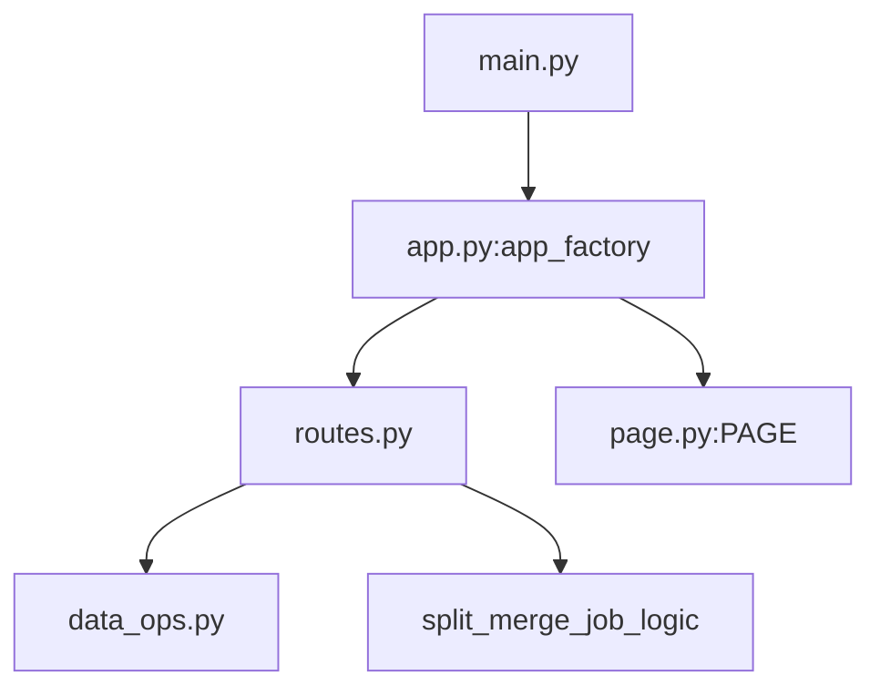

# GUI 可视化脚本小步重构计划

## 目标与范围

- 先聚焦一个文件： `[/data/vepfs/users/intern/lingyue.yang/Evo-RL-Piper/scripts/review_episode_tasks_gui.py](/data/vepfs/users/intern/lingyue.yang/Evo-RL-Piper/scripts/review_episode_tasks_gui.py)` ，避免一次性重构全部 GUI。
- 同时预留与  `[/data/vepfs/users/intern/lingyue.yang/Evo-RL-Piper/scripts/train_pipeline_gui.py](/data/vepfs/users/intern/lingyue.yang/Evo-RL-Piper/scripts/train_pipeline_gui.py)`  的后续统一路径，但本轮不强行合并两者。

## 现状拆解（为何会长）

- 一个文件同时承担：数据扫描/CSV读写、FastAPI 路由、异步任务管理、超大内联 `PAGE`（HTML/CSS/JS）。
- 关键“体积来源”是单个 `PAGE` 字符串和多组 API 路由共存，且 split/merge 的 subprocess 逻辑也在同一模块。

## 分阶段执行（每步可独立提交）

### Phase 0：备份与基线

- 备份原文件到新目录（例如 `scripts/gui_legacy/`），保留时间戳文件名，保证可快速回退。
- 记录运行基线：启动命令、关键 API（`/api/list`、`/api/episode/{id}`、`/api/split`）是否可用。

### Phase 1：先建目录，不改行为

- 新建 GUI 专用目录：`scripts/gui/episode_review/`。
- 先迁移入口壳子：
  - `main.py`（CLI/启动）
  - `app.py`（`app_factory` 外壳）
- 原脚本暂保留为“薄入口”或在同批次直接改文档入口（按你偏好二选一），但内部行为保持一致。

### Phase 2：优先抽离大块静态页面

- 将 `PAGE` 内联模板抽到 `scripts/gui/episode_review/page.py`（常量导出）。
- `app_factory` 只负责组装，不再携带大段 HTML/JS 字符串。
- 这一阶段不拆 API 语义，只做“搬家 + import”。

### Phase 3：按职责拆 API 与数据逻辑

- 新增 `scripts/gui/episode_review/data_ops.py`：`discover()`、`load_csv()`、`write_csv()`、category 相关函数。
- 新增 `scripts/gui/episode_review/routes.py`：集中注册 `/api/*` 路由。
- split/merge 子进程逻辑先留在 `routes.py`，后续再决定是否单独抽 `jobs.py`（避免一次过度拆分）。

### Phase 4：修引用与文档

- 更新文档中的启动路径（至少包括）：
  - `[/data/vepfs/users/intern/lingyue.yang/Evo-RL-Piper/docs/SOP.md](/data/vepfs/users/intern/lingyue.yang/Evo-RL-Piper/docs/SOP.md)` 
  - `[/data/vepfs/users/intern/lingyue.yang/Evo-RL-Piper/docs/training-min-loop-v0.md](/data/vepfs/users/intern/lingyue.yang/Evo-RL-Piper/docs/training-min-loop-v0.md)` 
  - `[/data/vepfs/users/intern/lingyue.yang/Evo-RL-Piper/docs/260316.md](/data/vepfs/users/intern/lingyue.yang/Evo-RL-Piper/docs/260316.md)`
- 检查是否还有硬编码 `scripts/review_episode_tasks_gui.py` 引用并同步更新。

## 验收标准（每阶段都能回归）

- 启动命令可运行，首页可打开。
- 标签增删改、类别管理、episode 详情、split/merge 触发与状态轮询可用。
- 无新增 lint 问题；接口路径与返回字段保持兼容。

## 结构草图（目标形态）

## 风险控制

- 每个 Phase 只做一种类型变更（先移动，再拆分，再改引用）。
- 先不跨文件抽“通用 GUI 框架”，避免牵动 `train_pipeline_gui.py`。

