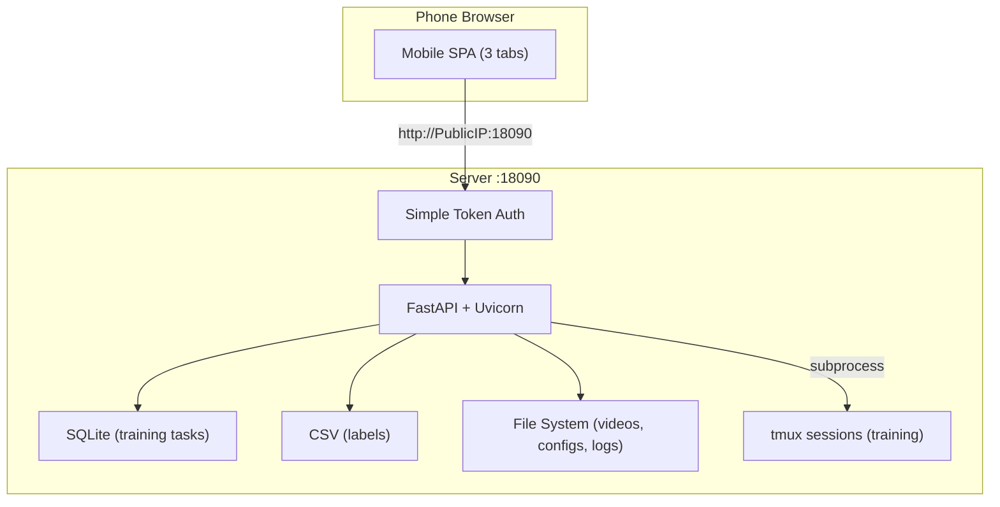

# WBCDClaw MVP

## 目标

满足 WBCDClaw.md 两个核心验收标准：

1. 手机上独立完成一次样本清洗（浏览 -> 看视频 -> 打标签 -> 下一条）
2. 手机上独立启动并确认一次 OpenPI 训练是否正常运行（选配置 -> 启动 -> 看 loss/日志）

## 架构




- **公网直连**：手机浏览器通过 `http://<公网IP>:18090` 直接访问
- **简单鉴权**：启动时指定 `--password`，首次访问输密码，cookie 保持登录
- **无构建步骤**：内联 HTML/CSS/JS（与现有 `review_episode_tasks_gui.py` 同模式）
- **标注兼容**：沿用 CSV 格式，与 `split_lerobot_v21_by_labels.py` 等管线工具兼容
- **训练解耦**：tmux 启动训练进程，web 崩溃不影响训练

## 文件结构

```
wbcd_claw/
├── __init__.py
├── app.py              # FastAPI app factory, 挂载路由 + static mount
├── config.py           # AppConfig dataclass
├── auth.py             # 简单密码中间件 (cookie-based)
├── sample_api.py       # 样本浏览/标注 API (从现有 GUI 提取)
├── train_api.py        # 训练任务 CRUD API
├── train_manager.py    # tmux + SQLite 训练任务管理器
├── pages.py            # 移动端 SPA HTML/CSS/JS
└── run.py              # CLI 入口
```

## 三个 Tab 页设计

### Tab 1: Dashboard

- 待标注数 / 已标注数 / 总数
- 运行中训练 / 最近失败
- "继续清洗" 按钮（上次停留位置）
- "启动训练" 快速入口

### Tab 2: Samples（核心页面）

- **列表视图**：全屏列表，搜索 + 筛选（全部/未标注/按标签），记住滚动位置
- **详情视图**（上中下三段）：
  - 上：视频预览（仅 left_wrist_cam 自动播放）
  - 中：episode_id、camera 数、标签、备注
  - 下（固定底栏）：标签按钮 + 保存 + 上一条/下一条
- 目标：每条样本 1-3 次点击完成

### Tab 3: Training

- **启动区**：选配置模板（扫描 `configs/train_pi*_openpi.yaml`），可编辑 exp-name，一键启动
- **状态区**：任务列表（运行中优先），状态标签，点击展开日志尾部

## 关键技术决策

- **复用现有代码**：从 [scripts/review_episode_tasks_gui.py](scripts/review_episode_tasks_gui.py) 提取 `discover()`, `read_csv()`, `write_csv()` 等核心函数
- **训练启动**：构造与 [scripts/train_pi.py](scripts/train_pi.py) 相同的命令，通过 `tmux new-session` 运行
- **训练配置**：解析 [configs/train_pi05_openpi.yaml](configs/train_pi05_openpi.yaml) 等 YAML，展示 config_name/backend/extra_args
- **日志获取**：`tmux capture-pane` 读取最近 N 行
- **任务状态**：SQLite 存储 task_id/config/status/timestamps，轮询 tmux session 存活状态更新

## MVP 不做

- 配置编辑页（直接用 YAML，手机上只改 exp-name）
- HTTPS（公网 HTTP 足够，密码保护已加）
- 预览资源预生成（直接 serve 原始视频）
- 样本历史/回滚、批量操作
- 关节角折线图、视频质量检查（桌面 GUI 保留）
- LeRobot (ACT) 后端

## 启动方式

```bash
# 服务器上（tmux 中运行）
PYTHONPATH=src python -m wbcd_claw.run \
  --video-root /data/.../videos \
  --label-csv /data/.../task_labels.csv \
  --configs-dir configs \
  --port 18090 \
  --password <your_password>

# 手机浏览器直接访问
# http://<公网IP>:18090
```

