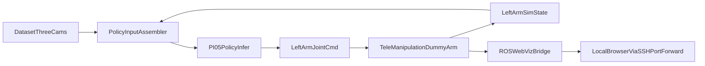

# 左臂仿真部署与可视化计划

## 目标

在不接真机的前提下，完成 `Evo-RL-Piper` 策略到 `TeleManipulation` 单左臂仿真接口的在线闭环：

- 图像输入：使用数据集三路图像（head/left_wrist/right_wrist）
- state 输入：从仿真实时读取左臂 state
- 动作输出：仅发送到左臂动作接口
- 可视化：支持 headless 服务器上的端口转发查看轨迹

## 实施范围

- 推理与输入组织复用现有 PI05/OpenPI 预处理定义，不重写模型输入规范：
  - `[/data/vepfs/users/intern/lingyue.yang/Evo-RL-Piper/third_party/openpi/src/openpi/training/config.py](/data/vepfs/users/intern/lingyue.yang/Evo-RL-Piper/third_party/openpi/src/openpi/training/config.py)`
  - `[/data/vepfs/users/intern/lingyue.yang/Evo-RL-Piper/third_party/openpi/src/openpi/policies/aloha_policy.py](/data/vepfs/users/intern/lingyue.yang/Evo-RL-Piper/third_party/openpi/src/openpi/policies/aloha_policy.py)`
  - `[/data/vepfs/users/intern/lingyue.yang/Evo-RL-Piper/third_party/openpi/src/openpi/models_pytorch/preprocessing_pytorch.py](/data/vepfs/users/intern/lingyue.yang/Evo-RL-Piper/third_party/openpi/src/openpi/models_pytorch/preprocessing_pytorch.py)`
- 仿真接口采用单臂 Dummy 模式：
  - `[/data/vepfs/users/intern/lingyue.yang/TeleManipulation/ros2_ws/src/arm_interface/arm_interface/arm_interface_node.py](/data/vepfs/users/intern/lingyue.yang/TeleManipulation/ros2_ws/src/arm_interface/arm_interface/arm_interface_node.py)`
  - `[/data/vepfs/users/intern/lingyue.yang/TeleManipulation/ros2_ws/src/arm_interface/arm_interface/dummy_arm.py](/data/vepfs/users/intern/lingyue.yang/TeleManipulation/ros2_ws/src/arm_interface/arm_interface/dummy_arm.py)`

## 关键流程

## 具体步骤

1. 定位并确认 checkpoint 路径（按 run 名称 `evorl_pi05_lora_A5_prompt_260318`）以及推理所需配置文件。
2. 新增一个“仿真部署桥接脚本”（放在 `Evo-RL-Piper/scripts/`），实现：
  - 订阅/读取左臂 state（ROS topic）
  - 从数据集循环提供三路图像帧（时间步对齐）
  - 组装模型输入并执行策略推理
  - 仅发布左臂关节命令（忽略右臂）
3. 启动 `TeleManipulation` 单臂 dummy 节点，形成 state/cmd 闭环。
4. 增加 headless 可视化通道：
  - 发布轨迹相关 topic（当前关节、目标关节、误差）
  - 启动 Web 可视化桥（可通过 SSH 端口转发在本地浏览器查看）
5. 编写最小运行文档（命令顺序、端口转发命令、常见问题），并给出一次验收 checklist（轨迹是否合理、动作是否稳定、是否只控制左臂）。

## 验收标准

- 能稳定跑通 5 分钟以上闭环，不崩溃。
- 左臂 `state -> action` 链路连续，且命令仅发送到左臂 topic。
- 本地浏览器通过端口转发能看到关节轨迹或状态曲线。
- 三路图像输入与 state 输入来源符合预期（日志可核对 key 和 shape）。

## 风险与规避

- checkpoint 命名与实际目录不一致：先做自动发现并打印候选路径。
- state 维度与策略期望不一致：在桥接层做显式维度检查并早失败。
- headless GUI 不可用：优先 Web 方案，保留纯日志/保存图像曲线作为降级。

